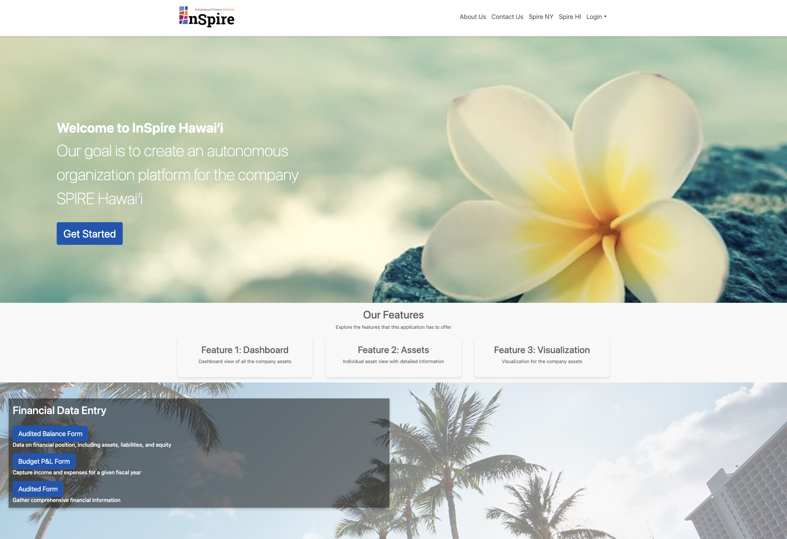

As I reflect on my experience with software engineering II this past fall semester, I can say that the most memorable part was working in a team and gaining the real world experience of a software engineer. The structured approach of the course was something I genuinely appreciated, as it introduced me to a more disciplined way of thinking about computer programming. Beyond the technical skills, the course emphasized teamwork, collaboration, and professionalism. 

## About the Client
For our semester project we collaborated with SPIRE Hawaii, a company specializing in accounting and advisory services. For this project, they hoped to achieve autonomy with their accounting and fiscal data. The challenge? SPIRE relies on Microsoft Excel to manage their financials, but they envisioned something far more dynamic and user-friendly—an application that could forecast their organization's value over time.

When we first met with the client, they walked us through their vision. They wanted a tool that could not only streamline their financial processes but also provide a forecase of the value of the organization overtime. In many ways, it reminded me of tools like QuickBooks, but tailored specifically to their unique needs. To begin, we had to understand the current scope and identify the gaps in their workflow. This set the stage for our semester journey which included up to seven milestones and up to 5 client meetings where each group would showcase their progress on their application.

## Frontend Development and Teamwork
As part of an eight-person team, my primary focus was on frontend development. One of my proudest contributions was the design of the landing page, which served as the application's first impression. Here's a snapshot of the page I mainly worked on:

In addition to frontend work, I took on the responsibility of coordinating group meetings. With such a large team, maintaining clear communication and ensuring we could all touch base and ensure that we were all doing something was essential. I valued how our group embraced flexibility and initiative, consistently addressing blockers, setting priorities, and meeting deadlines. 

 ## Real-World Skills in Action
This class felt like a simulation of the real-world software development environment. From regular client meetings, milestone-based progress updates, and to weekly code reviews, we got a taste of what it's like to deliver a product under professional conditions. The hands-on experience was invaluable. I mainly gathered the importance of understanding client needs and aligning our work with their vision. As a team, we underestimated how challenging it would be to integrate the forecasting features SPIRE required. If I could go back, I would emphasize that we have a clear vision of the project and timeline accounted for the intricacies of backend development and set the backend beforehand as this project was database heavy. 

## Final Thoughts
Overall, this software engineering class was a fantastic experience for anyone interested in software development. It wasn’t just about writing code, but also learning how to work in a team, communicate effectively with clients, and manage real-world projects. The skills I gained, both technical and interpersonal, will definitely prepare me for the next steps in my journey. I walked away with a deeper appreciation for collaboration, a stronger sense of discipline, and a pretty cool portfolio piece!
