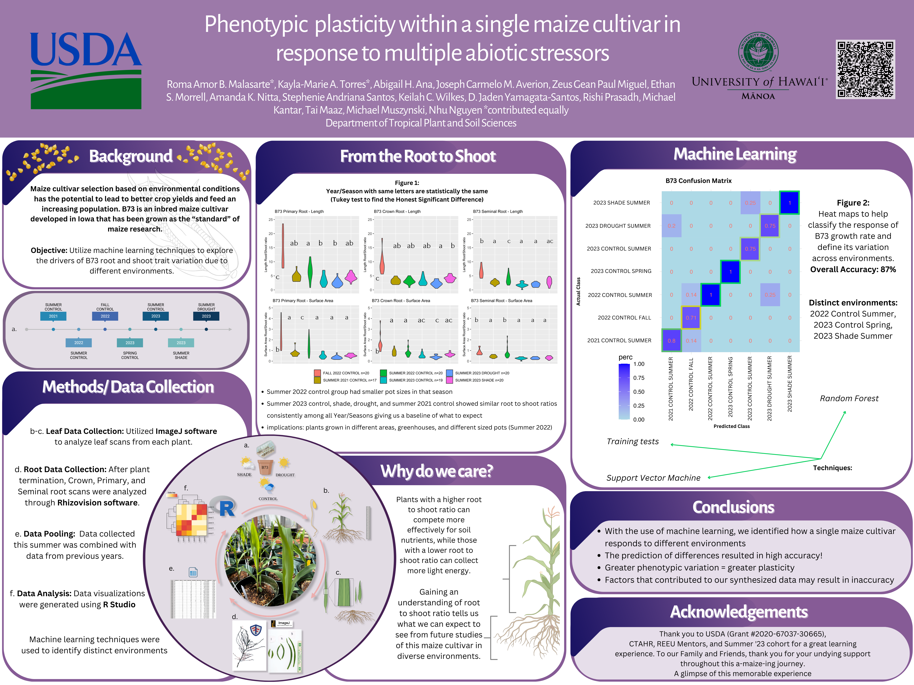

  

## _Corn Corn Corn_
I participated in the Data Driven Agriculture Research Experience last summer in 2023. The duration of this program went from June to Early August. For the first two and a half weeks, we learned about the special crop that we would be studying and how we will apply the necessary data for our research project in the end. I studied four different corn varieties such as B73, CML333, M162W, and CML222. Every day of the first few weeks, we visited our assigned plants at the Magoon Greenhouse. We watered these varieties every day under the conditions of control, shade, and drought. In the end, qualitatively, we saw how each genotype performed under those following conditions. Once we saw that our 4th shoot (leaf) was not growing anymore, we started separating our root and shoots to measure and begin gathering our data. We rinsed our roots, freezed them, thoroughly cleansed each root to perform scanning, and created data for our research. We used ImageJ to scan our leafs and we utilied rhizovision software to scan our roots. This process took us about a week to complete and gather all the data we needed. 

## _New Skills_
When time came for my team and I to decide the topic of our research project, we decided to take a look at the B73 cultivar’s Phenotypic plasticity within a single maize cultivar in response to multiple abiotic stress. In other words, how did the corn from Iowa adapt and change its physical characteristics under different environment conditions. We used R studio Markdown to create our visualizations and assess our data with different style plots. We applied the Tukey test and ANOVA to find the differences between means of season and treatment. We used machine learning table called a  confusion Matrix statistics to represent the accuracy of each season year and treament. I also learned more about SVM (Support Vector Machine) and Random Forest to classify, regress, and detect outliers.

  

The journey into this research experience introduced me to a plethora of skills and allowed me to connect with many people. This project expanded my plant knowledge and taught me how to manipulate data and analyze it to create conclusions. Although our conclusions may need to be visited again for accuracy, we hope that our findings would anticipate the information of where B73 corn is best to be grown in to provide an abundance of this food staple.
