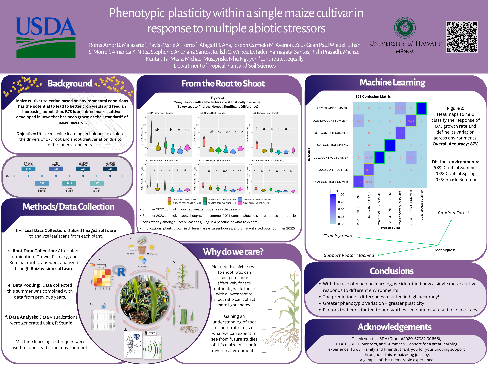

  

## _What is Kalo Stems?_
Kalo Stems is a platform that my group and I had created while taking ICS314 Software Engineering I course. This application will allow students at the University of Hawaiʻi at Mānoa to connect with career opportunities that they believe matches their interests and skills. It gives students the opportunity for industry partners to create a profile to learn about their company goals and how to connect. Likewise for the students, companies would be able to view various student profiles to match the skillsets or ambitiousness that they are looking for.

## _What I was able to contribute_
I mainly focused on the general tests for the application using testcafe-ci (continuous integration). Running testcafe allowed me to view a simulation of what it would look like if a user were to click on the log ins, navbar, or any button that I would like to test in our application. It was satisfying when it worked... however, when it didn't, plan b was to close my eyes and hope that it was a glitch. When that didn't work, I would do my best to resolve the issue. I found myself feeling fullfilling when the tests would work and seeing our application passing. For this project, Emily and I had also worked on the sign up and Register page, in which roles would be added for users to pick according to the role.

## _Now I know to..._
In the future, I would like to implement more features into the application and get it up and running in a more functional way. I think that our app has a lot of potential, despite a few of the challenges we had experienced. I had learned a lot about the technical and nontechnical skills needed in order to successfully create a deliverable as a software engineer through this project. On the nontechnical end, being able to collaborate with my group got a bit rocky during the end. What would I do next time? I would encourage my group and I to find a time and place to work on our assigned tasks in person. This would make it easier to ask for help from each other and figure out any issues we may be facing. On the technical aspect of it, I was trying to figure out the meteor methods for quite some time while working on the project, but I was not able to figure it out completely. It was a learning experience for myself and I hope that when I take on another project like this or improve Kalo Stems in the future, I would be able to implement nontechnical and technical methods that are successful and look for ways to improve on what did not work. This is not the end, Kalo Stems!

Learn more about Kalo Stems here: 
